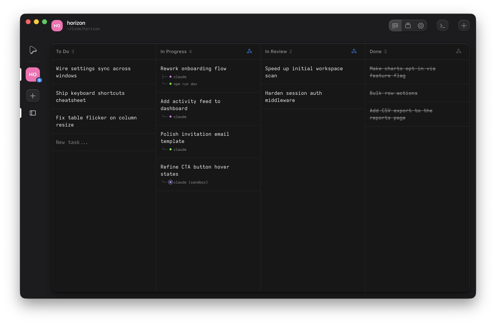
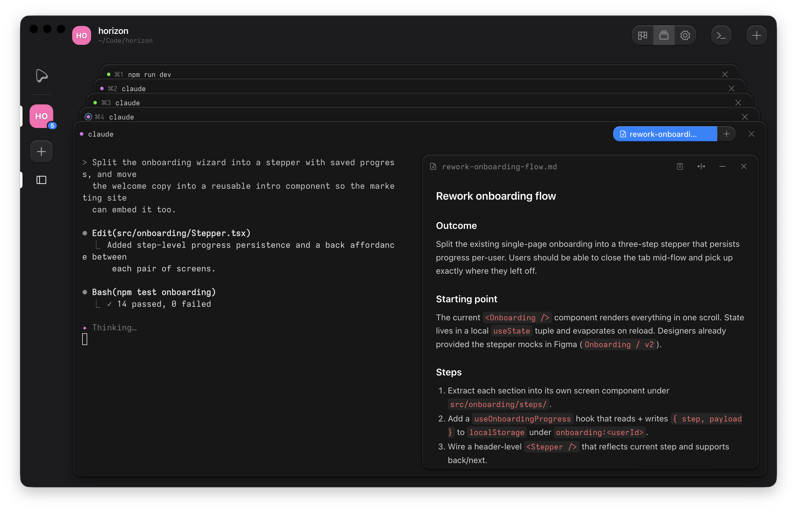
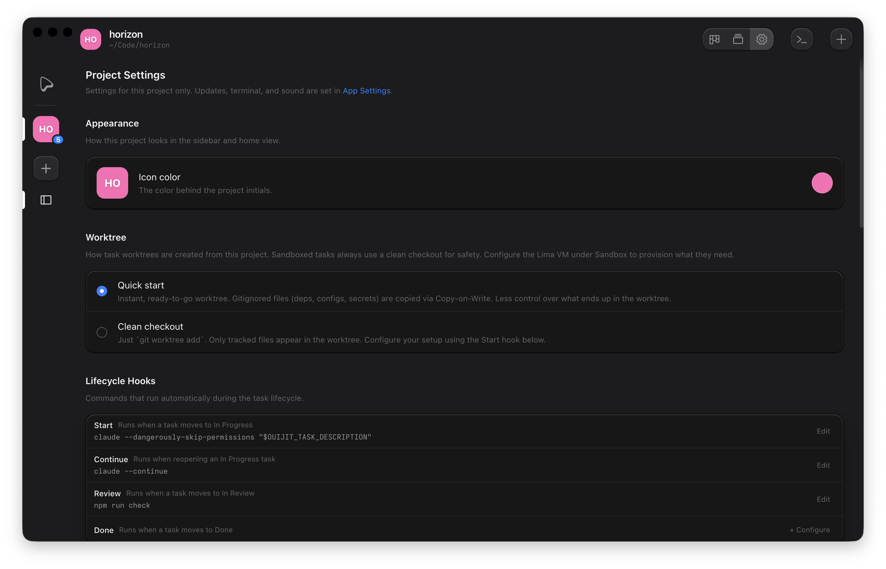

<picture>
  <source media="(prefers-color-scheme: dark)" srcset="website/public/assets/ouijit-logo.svg">
  <source media="(prefers-color-scheme: light)" srcset="website/public/assets/ouijit-logo-dark.svg">
  
</picture>

<br>

_Integrated Divination Environment._

Ouijit is a customizable task and terminal session manager that integrates with agent CLIs and TUIs like Claude Code via lifecycle hooks, scripts, and a session-aware CLI. It offers basic comforts for agentic development like live agent status with notifications, automatic worktree management for parallel workstreams, and VM sandboxing for untrusted code.

Download the latest release:

- [macOS (Apple Silicon)](https://github.com/ouijit/ouijit/releases/latest/download/ouijit-darwin-arm64.zip)
- [macOS (Intel)](https://github.com/ouijit/ouijit/releases/latest/download/ouijit-darwin-x64.zip)
- [Linux (x64)](https://github.com/ouijit/ouijit/releases/latest/download/ouijit-linux-x64.zip)

Free and open source. No account, no sign-in. [Docs](https://ouijit.com/docs/) · [All releases](https://github.com/ouijit/ouijit/releases)



Drag tasks between columns to move them through your workflow. Open any task to jump into its worktree and run an agent.



Run multiple terminals per task and read the active session's plan beside it. Check each agent's status from the tab header without switching sessions.



Wire commands to run on each task status change, choose how worktrees are provisioned, and save scripts you can launch from any terminal.

## Setup

Requires Node.js 20+, git, and C/C++ build tools for native modules (better-sqlite3, node-pty, koffi):

- **macOS:** `xcode-select --install`
- **Linux:** `sudo apt install build-essential python3` (Debian/Ubuntu)

```bash
git clone https://github.com/ouijit/ouijit.git
cd ouijit
npm install
npm start
```
