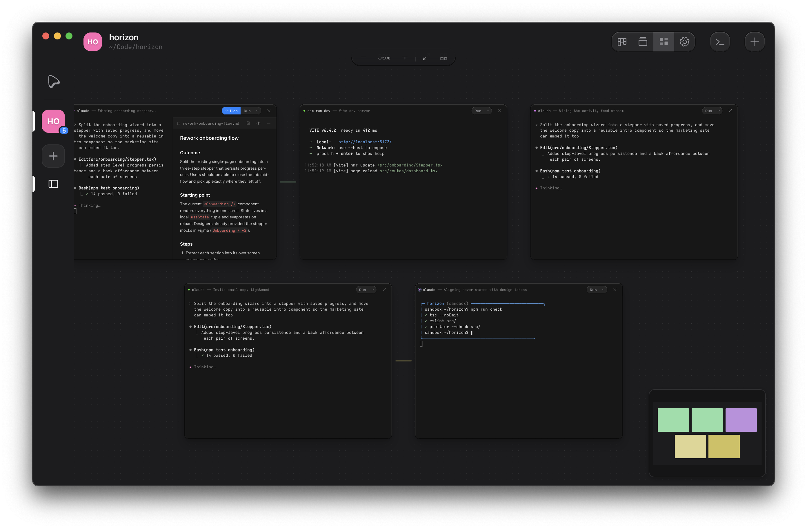

<picture>
  <source media="(prefers-color-scheme: dark)" srcset="website/public/assets/ouijit-logo.svg">
  <source media="(prefers-color-scheme: light)" srcset="website/public/assets/ouijit-logo-dark.svg">
  
</picture>

<br>

_Integrated Divination Environment._

Ouijit is a customizable task and terminal session manager that integrates with agent CLIs and TUIs like Claude Code via lifecycle hooks, scripts, and a session-aware CLI. It offers basic comforts for agentic development like live agent status with notifications, automatic worktree management for parallel workstreams, and VM sandboxing for untrusted code.

Download for [macOS or Linux](https://ouijit.com). Free and open source. No account, no sign-in.

[Docs](https://ouijit.com/docs/)

<table>
  <tr>
    <td></td>
    <td></td>
  </tr>
  <tr>
    <td></td>
    <td></td>
  </tr>
</table>

## Setup

Requires Node.js 20+, git, and C/C++ build tools for native modules (better-sqlite3, node-pty, koffi):

- **macOS:** `xcode-select --install`
- **Linux:** `sudo apt install build-essential python3` (Debian/Ubuntu)

```bash
git clone https://github.com/ouijit/ouijit.git
cd ouijit
npm install
npm start
```
