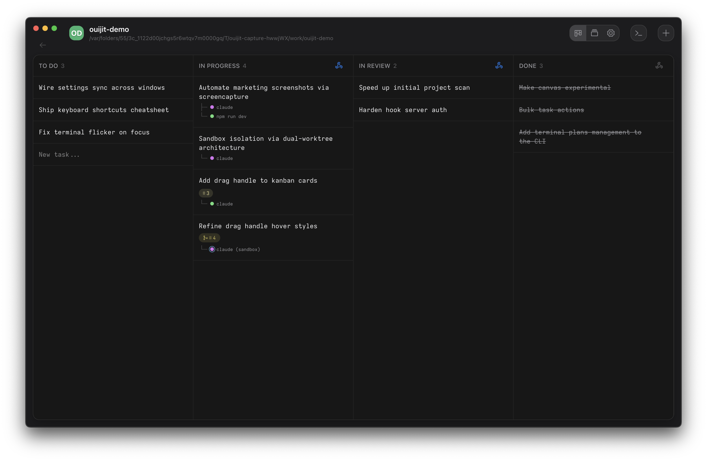
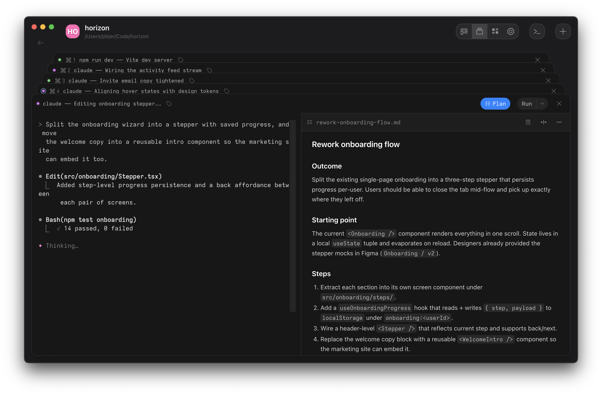
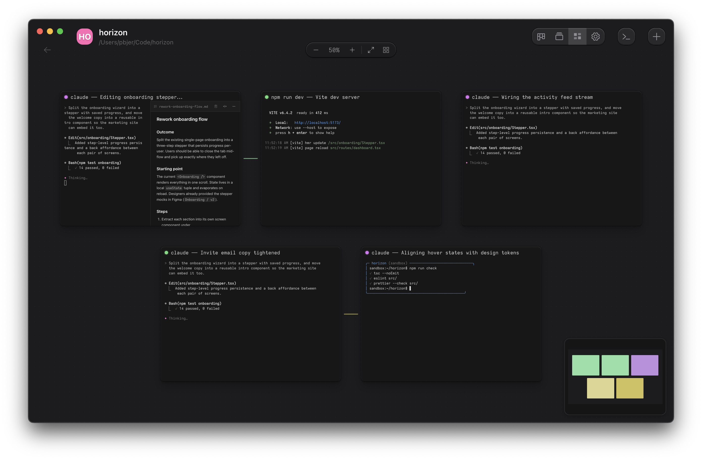
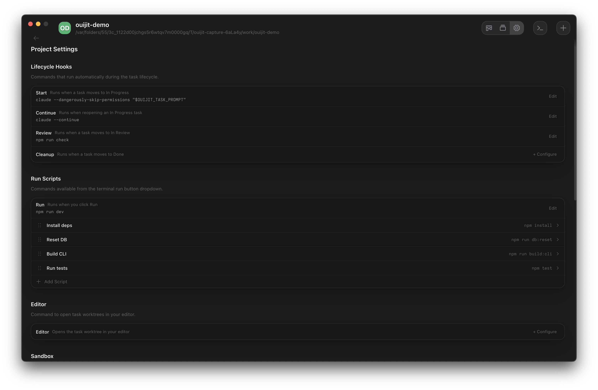

<br>

Kanban terminal manager for CLI agent workflows with automatic git worktree isolation and VM sandbox support included.

[macOS (Apple Silicon)](https://github.com/ouijit/ouijit/releases/latest/download/ouijit-darwin-arm64.zip) · [macOS (Intel)](https://github.com/ouijit/ouijit/releases/latest/download/ouijit-darwin-x64.zip) · [Linux](https://github.com/ouijit/ouijit/releases/latest/download/ouijit-linux-x64.zip)

<table>
  <tr>
    <td></td>
    <td></td>
  </tr>
  <tr>
    <td></td>
    <td></td>
  </tr>
</table>

## Why Ouijit

- **Kanban-first.** Tasks live on a board. Drag a card to In Progress and Ouijit creates a git worktree and a terminal for it. Drag to Done and the worktree is cleaned up.
- **Real terminals, not transcripts.** Each task gets its own xterm.js shell, not a fragile log replay. Bring any CLI agent — Claude Code, Codex, aider, plain bash.
- **Optional VM sandbox.** Lima-based isolation is a per-task toggle, not a setup tax. Skip it and Ouijit is just a kanban + terminal app.

## Requirements

- macOS 13+ (Ventura) or Linux x86_64
- `git` installed and on `PATH`
- A CLI agent of your choice. Claude Code is recommended but Ouijit works with any shell tool.

## Privacy

Ouijit runs entirely on your machine. There is no telemetry, no analytics, no remote logging.

The only network requests Ouijit makes on your behalf:

- **Auto-update check.** On macOS, via Electron's public update service (`update.electronjs.org`). On Linux, via the GitHub releases API for `ouijit/ouijit`. Disable with `OUIJIT_DISABLE_UPDATES=1` or in **Settings → Updates**.
- **External links.** When you click a link in the app, your default browser opens it.

That's all. Ouijit is open source under AGPL-3.0 — read the source if you want to verify.

## Setup (contributors)

Requires Node.js 20+, git, and C/C++ build tools for native modules (better-sqlite3, node-pty, koffi):

- **macOS:** `xcode-select --install`
- **Linux:** `sudo apt install build-essential python3` (Debian/Ubuntu)

```bash
git clone https://github.com/ouijit/ouijit.git
cd ouijit
npm install
npm start
```
