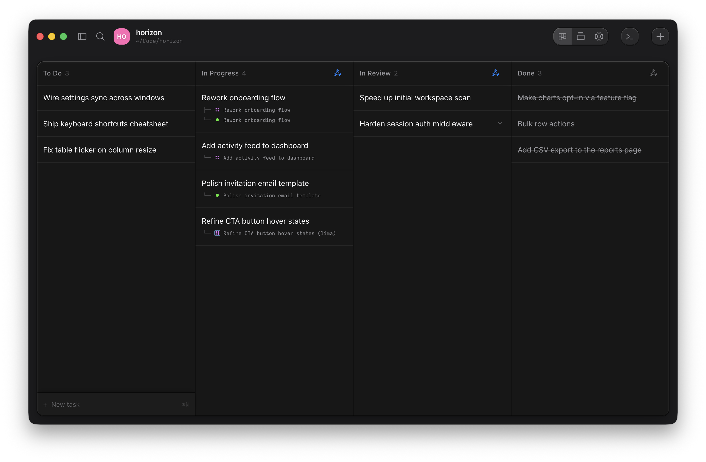
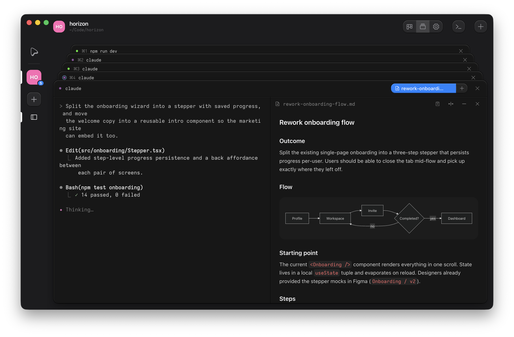
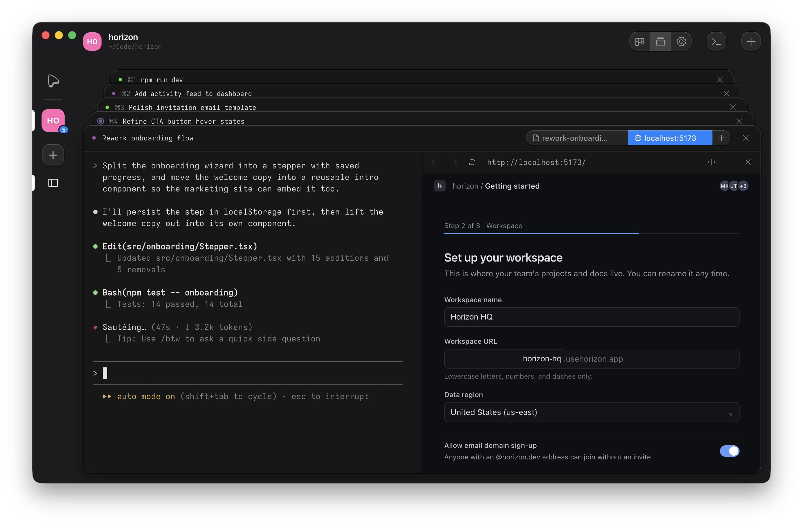
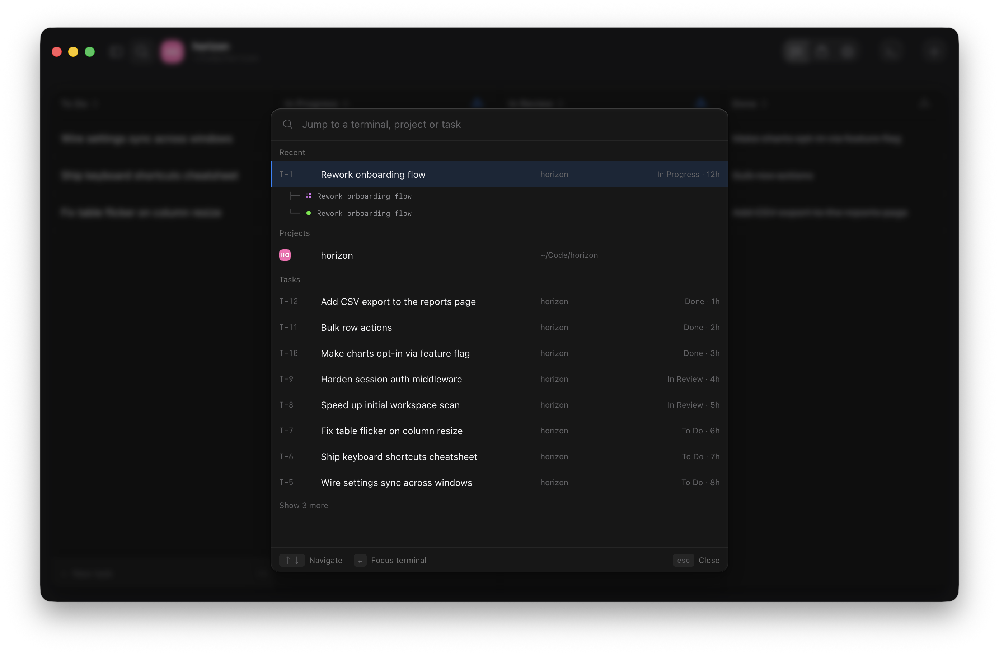
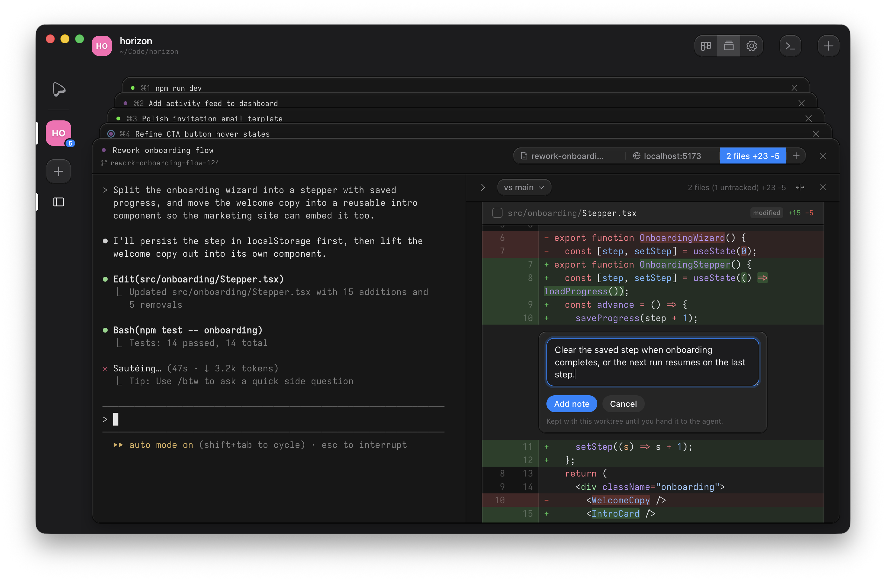
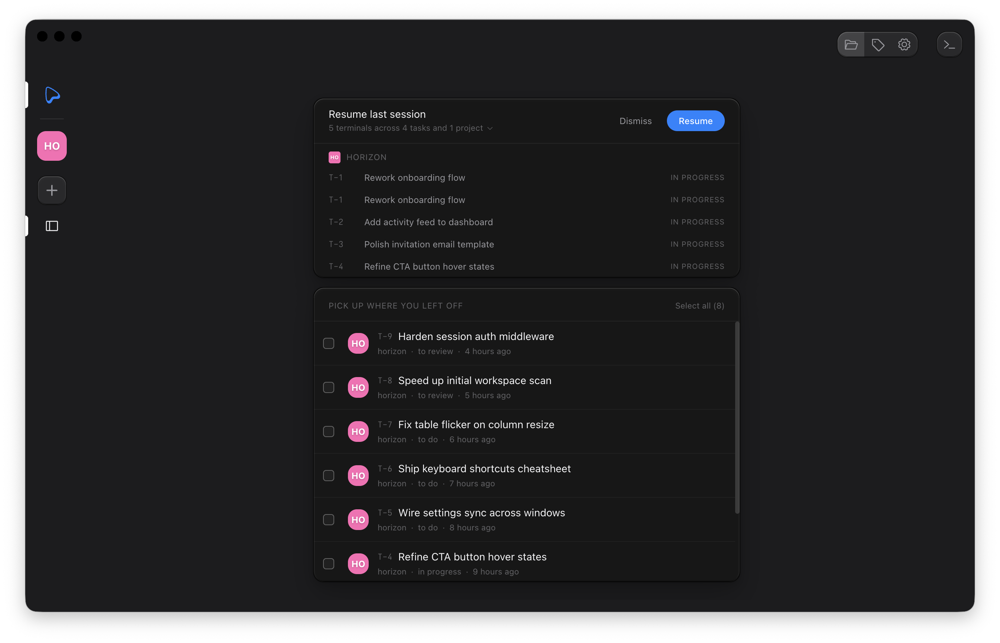
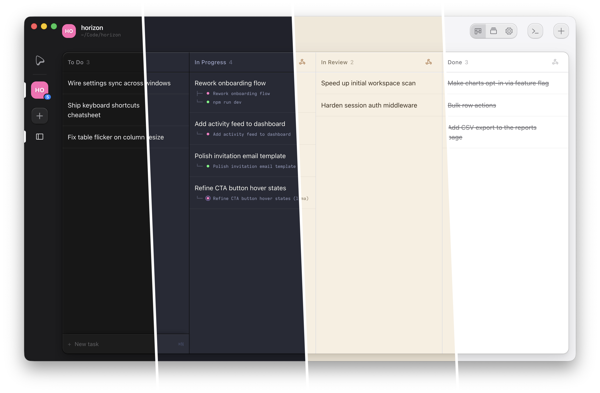
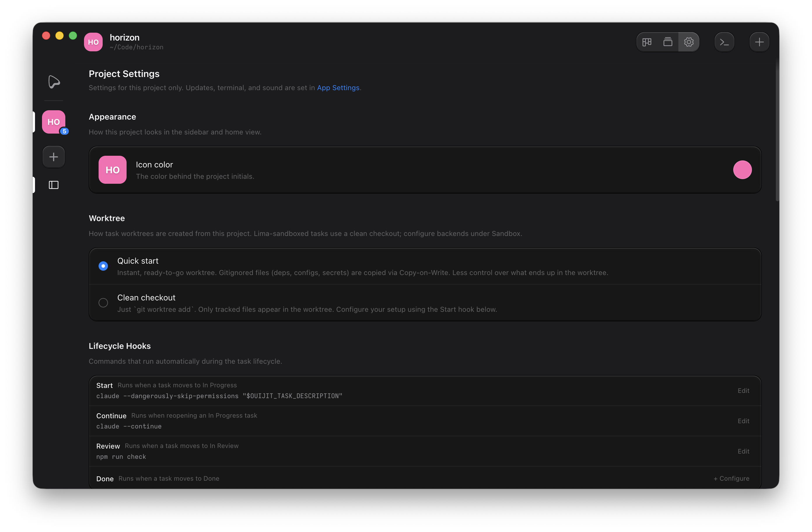

<picture>
  <source media="(prefers-color-scheme: dark)" srcset="website/public/assets/ouijit-logo.svg">
  <source media="(prefers-color-scheme: light)" srcset="website/public/assets/ouijit-logo-dark.svg">
  
</picture>

<br><br>

Ouijit is a task and terminal session manager for commanding parallel coding agents — by hand, with scripts, or through delegation. Every task gets its own git worktree and terminal, lifecycle hooks launch your agent CLI with the right context, and a session-aware CLI lets agents drive the board back. Live status with notifications, diff review, and per-terminal sandboxing round it out.

Download the latest release:

- [macOS (Apple Silicon)](https://github.com/ouijit/ouijit/releases/latest/download/ouijit-darwin-arm64.dmg)
- [macOS (Intel)](https://github.com/ouijit/ouijit/releases/latest/download/ouijit-darwin-x64.dmg)
- [Linux (x64)](https://github.com/ouijit/ouijit/releases/latest/download/ouijit-linux-x64.zip)

Free and open source under AGPL-3.0. No account, no sign-in, no telemetry.

[Website](https://ouijit.com/) · [Docs](https://ouijit.com/docs/) · [FAQ](https://ouijit.com/faq/) · [All releases](https://github.com/ouijit/ouijit/releases)



## Tasks and worktrees

Tasks live on a kanban board, and dragging a card between To Do, In Progress, In Review, and Done fires the matching lifecycle hook. Starting a task creates an isolated git worktree — on APFS as a copy-on-write clone, so it lands instantly with `node_modules` and the rest of your gitignored state intact, with a plain `git worktree` checkout as the alternative. Chain tasks off a parent's branch, select several cards and act on them at once, set a per-task merge target, and attach images or files to a task's prompt.

## Terminals and panels

Each terminal is a card in a stack, and panels attach to it as tabs: a runner for the dev server or any project script, a web preview, and markdown files rendered with Mermaid diagrams — so a plan opens beside the agent working from it. Shells that don't belong to any task get their own strip on the board, and sessions can be tagged and filtered.





## Working with agents

Ouijit shadows the agent binaries on PATH to inject lifecycle hooks and a reference for the `ouijit` CLI into each session, so agents can create tasks, advance the board, and open panels with no setup. The board shows each agent's live status, and a sound or OS notification fires when a turn ends.

## Command palette

⌘K (Ctrl+K on Linux) jumps between terminals, projects, tasks, and pull requests, ranked by how often you return to them. Opening a task that was never started creates its worktree on the way.



## Diffs and pull requests

Every task terminal carries a diff of its worktree — against its merge target, uncommitted changes, or any base you pick — with word-level highlighting and image previews. Notes left on diff lines are handed to the agent working in that worktree and re-anchor as the code moves. An experimental GitHub surface adds a pull request inbox, inline review comments staged locally until you send them, and merging; it drives the `gh` CLI, so `gh auth login` is the only setup.



## Sandboxing

Any terminal can run sandboxed: in a Lima VM that mounts only the task's worktree, or in place under Seatbelt/Landlock via nono (experimental).

## Session resume

Quitting saves the session. The next launch offers to bring its terminals back in their worktrees, panels included.



## Themes

System, light, and dark, five bundled presets, and custom themes defined as design-token overrides — switchable in settings or with `ouijit theme use`.



## Hooks, scripts, and settings

Six lifecycle hooks (start, continue, run, review, done, editor) and per-project scripts define how tasks launch and what runs alongside them.



Also in the box: a multi-project home view, a configurable projects folder, `git init` for folders that need it, an editor launcher, health checks for the agent CLIs, first-run onboarding, terminal font settings, auto-update on macOS with release notes, and a local REST API behind the CLI. Everything is stored locally in SQLite.

## Supported harnesses

- [Claude Code](https://claude.com/claude-code)
- [Codex](https://github.com/openai/codex)
- [Pi](https://pi.dev)
- [OpenCode](https://opencode.ai)

To request support for another harness, [open an issue](https://github.com/ouijit/ouijit/issues/new).

## CLI

The `ouijit` command is available in every terminal Ouijit opens. You can use it directly from the shell to create and advance tasks, manage hooks and scripts, stage pull request comments, switch themes, or open markdown files and web previews as panels on the current terminal:

```bash
ouijit task list                              # array of tasks in the current project
ouijit task current                           # task owning this terminal
ouijit task create-and-start "Fix login bug"  # new task + worktree + terminal
ouijit task set-status 5 in_review
ouijit hook set start --command 'claude "$OUIJIT_TASK_DESCRIPTION"'
ouijit script run Lint
ouijit pr draft add 116 --file src/api.ts --line 88 --body "throws when the token is missing"
ouijit theme use dracula
ouijit markdown add ./plan.md                 # open a markdown file as a panel
ouijit preview add http://localhost:3000      # open a web preview panel
```

The supported harnesses know how to use it out of the box. Output is JSON on stdout for easy piping into `jq`. Full command list in the [docs](https://ouijit.com/docs/#cli).

## Setup

The app needs macOS 13+ (Apple Silicon or Intel) or Linux x64, with git 2.20+ on PATH. Nothing else — the downloads above are self-contained.

Building from source additionally requires Node.js 20+ (the repo pins 22 in `.nvmrc`) and C/C++ build tools for native modules (better-sqlite3, node-pty, koffi):

- **macOS:** `xcode-select --install`
- **Linux:** `sudo apt install build-essential python3` (Debian/Ubuntu)

```bash
git clone https://github.com/ouijit/ouijit.git
cd ouijit
npm install
npm start
```
